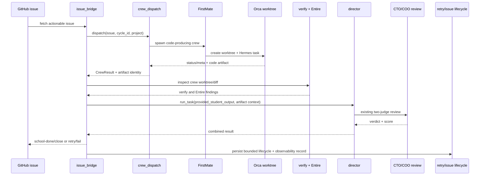

# Compound execution — code-producing FirstMate issue path

**Target repository:** `school-core`

## Summary

Land U7, U8, and U9 as a single verified vertical capability: a GitHub issue can be dispatched to a FirstMate→Orca→Hermes crew that edits code, the resulting worktree is preserved or transferred for verification, the existing verify/Entire/CTO+COO review and scoring path evaluates the actual crew changes, and failures fall back to direct-Orca without consuming or losing the issue incorrectly.

This plan uses the compound-engineering loop:

```text
recon → grill → wayfinder → ce-plan → Beads → TDD
     → bounded implementation waves → doubt review → local gates
     → owner-controlled merge → live issue proof → retrospective
```

The plan is deliberately stricter than the current U7 scout implementation. A `report.md` alone is not proof of a code change. The code-producing crew artifact and the checkout inspected by verification must refer to the same work.

---

## Problem frame

FirstMate spawning is proven operationally, and U7 is implemented on `feature/u7-crew-dispatch` at `b908ddb`, but U7 is not on `main`. The current bridge on `main` still dispatches direct-Orca work. The intended U8 contract also requires a new `provided_student_output` seam in `director.run_task`; that seam does not yet exist on `main`.

The current U7 wrapper launches FirstMate in scout mode, reads `report.md`, and removes the Orca worktree. U1 must change and test that concrete invocation rather than merely documenting a new mode. That shape is safe for report-only reconnaissance but is insufficient for the selected product behavior: **the issue path must use a code-producing crew**. If the worktree is removed before verification, the bridge can verify an unrelated fresh checkout while reviewing prose from the crew. That would create a false compiler-before-critic result.

The implementation must therefore establish one canonical artifact relationship:

```text
crew worktree/diff
  → preserved or exported into the verification checkout
  → verify gate and Entire inspect that exact code
  → director review/scoring consumes the corresponding deliverable
  → issue lifecycle records the same crew correlation ID
```

---

## Scope boundaries

### In scope

- U7 lifecycle contract adapted for code-producing work.
- U8 bridge wiring behind `CREW_ENABLED` with direct-Orca fallback.
- Optional `provided_student_output` injection into the existing review/scoring path.
- Worktree/diff preservation until verify and Entire complete.
- In-flight duplicate protection and bounded per-cycle crew dispatch.
- U9 result, board, durable record, workflow, and documentation surfacing.
- Structured, bounded observability for crew lifecycle and fallback decisions.
- TDD coverage, adversarial design review, local quality gates, and one controlled live issue proof.

### Out of scope

- Replacing the existing CTO/COO review model.
- Making Entire a blocking gate.
- Replacing direct-Orca execution entirely.
- Building the full asynchronous teacher/AgentMail lifecycle.
- General refactoring of `conductor.py`, `board.py`, or broad exception handling.
- Changing the human approval policy.
- Changing retry budget semantics beyond preserving the existing retry-once behavior.

### Deferred to follow-up work

- Layer 3 write-side consolidation under `loop-*` IDs.
- Async teacher review and dead-letter handling.
- Approval/risk policy design.
- Terminal-record retention beyond the bounded registry needed for the selected rollout; the local atomic claim lock is in scope, while multi-host/distributed locking is deferred.

---

## Requirements traceability

- **R7:** enabled issue work dispatches through FirstMate `--mode local-only --backend orca` and reads the code-producing deliverable.
- **R8:** spawn failure, blocked grace expiry, failed status, missing artifact, or timeout falls back to direct-Orca in the same cycle; a second failure follows existing retry-once behavior.
- **R9:** the existing verify, Entire, CTO/COO review, and scoring machinery runs on the crew's actual code/deliverable.
- **R10:** campus and README describe the real flag, fallback, registry, and artifact behavior.
- **KTD-4:** FirstMate wraps direct-Orca behind a flag.
- **KTD-7:** crew output enters through `director.run_task`, not a duplicated review path.
- **KTD-8:** in-flight state prevents duplicate crew dispatch across cycles.

---

## Decisions locked before implementation

### D1 — Code-producing crew, not scout-only crew

The production issue path uses FirstMate `--mode local-only --backend orca` (not `--scout`, `--direct-PR`, or `--no-mistakes`). This mode edits the assigned Orca worktree, commits locally on the task branch (`fm/<task-id>`), and does not push or open a PR. The brief must require both a `done:` status marker containing the local branch/commit identity and a bounded `report.md` containing completion evidence. Scout mode remains available for diagnostics, but it is not the production issue-path artifact.

### D2 — Preserve the exact crew worktree through verification

The artifact strategy is locked: **preserve the crew's Orca worktree until verify, Entire, and the existing review/scoring path have consumed it**. The bridge owns this sequence and its `try/finally` cleanup boundary:

```text
claim → spawn → validate artifact
  → run_verify_gate(crew_worktree)
  → run_entire_review(crew_worktree, base_ref)
  → director.run_task(provided_student_output, artifact_context)
  → persist terminal result
finally → teardown_worktree(crew_worktree)
```

The FirstMate metadata must provide the worktree path, local branch, commit identity, and the base commit/ref from which the task started. The canonical interfaces are:

```python
@dataclass(frozen=True)
class ArtifactContext:
    worktree_path: Path
    base_ref: str
    base_commit: str
    branch: str
    commit: str
    report_path: Path

# bridge-owned gates
_run_verify_gate(repo_path: Path, issue: dict, artifact: ArtifactContext | None = None)
_run_entire_sensor(repo_path: Path, base_ref: str = "main")

# director provenance seam
director.run_task(..., provided_student_output: str | None = None,
                 artifact_context: ArtifactContext | None = None)

# Entire implementation seam
run_entire_review(worktree_path: str, base_ref: str = "main")
```

For a crew result, the bridge passes the same `ArtifactContext` to all three consumers and the director. No fresh clone may substitute for the crew checkout. `run_entire_review` compares the recorded crew commit against the recorded base ref, not an implicit `main`. Teardown is never allowed before all three consumers and the local terminal durable record complete.

The new `ArtifactContext`, `CheckpointFn`, `GitRunner`, `checkpoint_claim`, and `checkpoint_terminal` definitions live in `crew_dispatch.py` (the standalone lifecycle boundary). `GitRunner` is a tiny injectable protocol: `run(args: Sequence[str], *, cwd: Path, timeout: int) -> CompletedProcess`, with no shell interpolation. Add `github_actions_checkpoint_callbacks(repo_root: Path) -> tuple[CheckpointFn, CheckpointFn]` there; it uses the checkout's persisted Git credential helper for `git pull/push` and reads `GH_TOKEN` only for GitHub CLI/API operations. It does not receive or log a raw token. `bridge_issues(...)` gains keyword-only injection points `crew_dispatch_fn`, `checkpoint_claim_fn`, and `checkpoint_terminal_fn`; the module entrypoint resolves `SCHOOL_LOOP_CHECKPOINTS=github-actions` to `github_actions_checkpoint_callbacks(Path(__file__).parent)` and passes both callbacks into `bridge_issues`. Unit tests pass fakes. The default/manual bridge path passes no remote checkpoint callback and therefore remains direct-Orca.

Teardown happens only after all consumers finish, and it is best-effort. If teardown fails, the result remains successful but records `teardown_ok=false` and the worktree identity for operator cleanup. A report-only handoff, copied prose, or verification of an unrelated checkout is never a valid code-producing success.

### D3 — Direct-Orca remains the fallback

Any crew result other than a complete, artifact-bearing success goes through the existing direct-Orca path in the same cycle. Crew failure is not silently treated as a successful direct result, and fallback errors remain subject to the current retry file and retry limit.

### D4 — Feature flag is fail-safe

`CREW_ENABLED=1` enables the crew path. Absent, `0`, or invalid values use direct-Orca and emit a bounded warning for invalid input. The initial test environment remains crew-off unless a test explicitly enables it.

### D5 — Observability is part of the contract

Every crew attempt has a correlation tuple: issue number, cycle session ID, crew ID, artifact/worktree identity, and local branch/commit identity. The existing `ActivityLog.student_stage(...)` is the human-readable activity sink, using its bounded stages (`boot`, `hermes_thinking`, `bookbag_written`, `done`, `error`) and short detail text. The existing `issue_bridge.record_run(...)` / `data/last_run.json` is the durable per-issue sink and carries a compact `crew` block. Records contain statuses and bounded reasons, never prompts, report bodies, secrets, tokens, absolute home paths, or full codebase contents.

### D6 — Owner controls merge

The plan prepares mergeable commits and updates Beads/plan state, but does not push or merge automatically. The owner decides when the integration branch is ready and authorizes the live issue proof.

---

## High-level technical design

### End-to-end sequence



### Result-state contract

| Crew result | Required bridge behavior | Issue/retry behavior |
|---|---|---|
| `done` + valid code artifact + valid report | Verify actual artifact, then run normal review/scoring | Success may close through existing policy |
| `done` + missing/invalid artifact | Do not verify unrelated code; direct-Orca fallback | Fallback failure uses retry-once |
| `spawn_failed` | Direct-Orca same cycle | Fallback failure uses retry-once |
| `blocked` after grace | Direct-Orca same cycle | Do not consume retry budget unless fallback fails |
| `failed` | Direct-Orca same cycle | Do not mark school-failed from crew failure alone |
| `timeout` | Direct-Orca same cycle; clean up best-effort | Fallback failure uses retry-once |
| in-flight record for same issue | Do not spawn duplicate crew | Leave issue eligible for the next cycle; do not increment retry count |

---

## Wave 1 — land the verified vehicle

### U1. Establish the U7 landing boundary and artifact contract

**Goal:** Create `feature/u7-u9-crew-path` from the current `main` integration base, reconcile the reviewed U7 branch into it, and adapt the lifecycle from scout-only output to the locked code-producing contract without wiring the bridge yet.

**Dependencies:** None.

**Landing boundary:** `main` at the execution-time merge base is authoritative. U7's `feature/u7-crew-dispatch` at `b908ddb` is an input, not a base. Rebase or cherry-pick the reviewed U7 commits onto `feature/u7-u9-crew-path`, resolve conflicts against current `main`, and record the exact resulting base and commit IDs in the handoff. U8 cannot begin until the reconciled U7 commit is tested on that branch.

**Files:**

- `crew_dispatch.py`
- `tests/test_crew_dispatch.py`
- `data/crew_runs.json` (mandatory tracked state; initialize with an empty sanitized list if absent)
- `docs/plans/2026-08-11-001-feat-pipeline-context-verify-dispatch-plan.md` only for factual status reconciliation during close-out

**Approach:**

- Start from the reviewed U7 commits `31dac09` and `b908ddb`, but reconcile them onto the current `main` base on `feature/u7-u9-crew-path` before any bridge wiring.
- Replace the production spawn invocation with the exact argv `FM_SPAWN <crew_id> <project_dir> --mode local-only --backend orca`; test that it is not scout/direct-PR/no-mistakes. Make the brief require `report.md`, and record the task branch, base ref/commit, resulting commit, worktree path, and report path in the result/registry.
- Ensure teardown is deferred until verify, Entire, and director review/scoring have consumed the preserved worktree. Keep direct Orca removal as the cleanup primitive because FirstMate's generic teardown rejects Orca IDs containing repository/path separators.
- Make the registry bounded enough for the first rollout: terminal transitions must be recorded, and stale in-flight records must be distinguishable from completed records.
- Protect the read/check/claim/write sequence with an atomic per-registry lock (exclusive lock-file creation, bounded stale-lock recovery, and atomic JSON replacement). Claim before spawn; store a unique owner ID and claim timestamp; release or transition the claim on spawn failure, terminal result, fallback, and teardown. Set `CREW_CLAIM_STALE_SECONDS=1800` as the named default (30 minutes, greater than the 15-minute crew timeout); tests use a small injected value. Before the external spawn, the bridge calls this production checkpoint interface:

```python
CheckpointFn = Callable[[dict], bool]

class GitRunner(Protocol):
    def run(
        self,
        args: Sequence[str],
        *,
        cwd: Path,
        timeout: int,
    ) -> CompletedProcess: ...

checkpoint_claim(
    claim: dict,
    *,
    repo_root: Path,
    git_runner: GitRunner,
) -> bool
```

`checkpoint_claim` sanitizes mandatory tracked `data/crew_runs.json`, runs `git add data/crew_runs.json`, commits as `chore: checkpoint crew claim [skip ci]`, pulls with rebase, and pushes through the checkout's persisted Git credential helper. In the Actions workflow, `GH_TOKEN: ${{ secrets.GITHUB_TOKEN }}` remains the existing API/CLI mapping; the callback does not depend on an undefined `GITHUB_TOKEN` variable. All pre-spawn and terminal checkpoint calls share the fixed runner-local lock path `<repo_root>/.git/git-checkpoint.lock`; this serializes read/rebase/commit/push across issues in the same cycle. Lock acquisition uses exclusive create (`O_CREAT|O_EXCL`) and writes a random owner token plus PID/timestamp. The owner must release it in `finally` after the push attempt. `CREW_CHECKPOINT_LOCK_STALE_SECONDS=120` is separate from the 1800-second crew-claim deadline; a lock older than that value may be recovered only after checking that its PID is no longer alive. A live lock is never stolen. Each call re-reads current `crew_runs.json`, merges only its claim/terminal transition, and pushes the resulting state, so a second issue cannot overwrite the first claim. It may retry one non-fast-forward conflict after `git pull --rebase`; authentication failure, a second conflict, or any other push failure returns `False`. If it returns `False`, the bridge releases the local claim, does not invoke FirstMate, emits a bounded checkpoint-failure record, and uses the existing direct-Orca path.

In GitHub Actions, the workflow supplies the real callback. Manual/local bridge runs do not push by default: with no injected `CheckpointFn` they force direct-Orca even when `CREW_ENABLED=1`; unit tests inject a fake callback and never contact a remote. This prevents a developer shell from silently pushing state.

A fresh checkout in the next school-loop cycle must see the pushed claim. A second bridge process must observe the `running` claim rather than spawn the same issue. A crash-recovery test must prove that a live claim cannot be stolen, a stale claim can be reclaimed only after the configured deadline, and a fresh checkout sees the pre-spawn claim. Do not claim full multi-host coordination beyond this local runner boundary.

**Execution note:** Characterization-first where the current U7 behavior conflicts with the code-producing contract. Preserve the strong existing lifecycle tests, then add failing tests for artifact preservation before changing teardown behavior.

**Test scenarios:**

- A successful `local-only` crew returns a worktree path, `fm/<task-id>` branch, base ref/commit, resulting commit identity, and report path while the worktree remains available to verification.
- A scout/report-only result, missing branch/commit/base identity, missing worktree, or missing report is rejected as an invalid production artifact rather than treated as code success.
- Two concurrent dispatch attempts for the same issue produce one `running` claim; the loser returns an in-flight result without spawning.
- A process crash after claiming can be reclaimed only after `CREW_CLAIM_STALE_SECONDS` (default 1800 seconds); a live owner claim cannot be stolen.
- The sanitized `running` claim is committed and pushed before external spawn by the authenticated execute-job actor; a fresh checkout in the next cycle sees it and skips duplicate dispatch.
- A failed pre-spawn checkpoint releases the claim and uses direct-Orca without spawning FirstMate.
- Spawn failure returns a typed failure without creating a false running record.
- Timeout, blocked, failed, and missing-report outcomes retain enough metadata for fallback and cleanup.
- Orca cleanup failure is non-fatal but remains visible and retryable.
- A stale in-flight record can be reclaimed without deleting an unrelated worktree.
- Status and artifact identity are bounded and contain no token, prompt, or full source payload.

**Verification:** The reconciled U7 module imports on `feature/u7-u9-crew-path` from the current `main` base, focused tests pass, and the module can be reviewed without the bridge dependency.

### U2. Add the director deliverable seam

**Goal:** Allow a crew-produced response and its exact preserved worktree to enter the existing `director.run_task` review/scoring path without invoking a second student model call or duplicating review logic.

**Dependencies:** U1 contract decision.

**Files:**

- `director.py`
- `tests/test_director.py` or the repository's existing director-focused test file
- `tests/test_spec_gate.py` where signature/forwarding behavior is already covered
- `src/entire_review.py`
- `tests/test_entire_review.py`

**Approach:**

- Add optional `provided_student_output` and a single structured artifact-context input containing `worktree_path`, `base_ref`, `base_commit`, `branch`, and `commit`; preserve the same default behavior as today when absent. The bridge, not `director`, owns the verify/Entire calls; `director` accepts the context for review/scoring provenance and does not reorder the pre-review gates.
- When present, bypass only the internal student-generation call; retain readiness, verification, Entire integration, adversarial review, CTO/COO review, scoring, trajectory, and result-shape behavior unless an existing contract explicitly forbids a phase.
- Define one canonical artifact-context argument consumed by the verification/Entire hooks; do not run those hooks on a separate cloned `repo_path`. Keep it optional so the direct path remains unchanged.
- Define the interaction with `isolated_phases`, `skip_review`, and other mode flags rather than allowing ambiguous combinations.
- Preserve the direct path byte-for-byte at the behavior level when the option is absent.

**Test scenarios:**

- No provided output: existing student call and review behavior remain unchanged.
- Provided output: student generation is skipped and the exact supplied output reaches review/scoring.
- Provided output with worktree context: verify and Entire receive the exact supplied worktree plus its recorded base ref.
- Provided output with empty content or missing artifact context: explicit failure or fallback behavior is deterministic.
- Provided output with `skip_review` or isolated mode: the contract rejects or handles the combination explicitly.
- Verification and scoring still receive the same domain, difficulty, session, and codebase context.

**Verification:** Existing director suite remains green; new tests prove the seam changes only the student artifact source.

### U3. Wire U8 behind the flag with fallback and duplicate protection

**Goal:** Route eligible issues through FirstMate when enabled, while preserving direct-Orca behavior and retry semantics for all failures.

**Dependencies:** U1 and U2.

**Files:**

- `issue_bridge.py`
- `crew_dispatch.py`
- `tests/test_issue_bridge.py`
- `tests/test_crew_dispatch.py`
- `.github/workflows/school-loop.yml` for the authenticated pre-spawn and terminal checkpoint callback mode plus the `CREW_CLAIM_STALE_SECONDS` environment contract

**Approach:**

- Read and validate `CREW_ENABLED` once per bridge cycle.
- Read `CREW_MAX_PER_CYCLE` once and cap crew attempts before dispatch; remaining issues use direct-Orca this cycle.
- Check in-flight state by issue number before spawning. An in-flight skip is not a failure, does not increment retry count, and remains visible as deferred/in-flight.
- Claim the issue before spawn under the U7 registry lock; record owner ID and claim timestamp. Invoke the authenticated pre-spawn `checkpoint_claim` callback, which sanitizes/commits/pushes `data/crew_runs.json` before FirstMate is called. A second bridge process or fresh next-cycle checkout observes `running` and skips without spawning. If checkpointing fails, release the claim and use direct-Orca.
- Set and validate `CREW_CLAIM_STALE_SECONDS` once per cycle; do not infer the stale deadline from the poll interval.
- After verify/Entire/director and before issue close or `processed_issues.json`, invoke this terminal persistence interface using the same authenticated push contract:

```python
checkpoint_terminal(record: dict, *, repo_root: Path, git_runner: GitRunner) -> bool
```

On push conflict, retry once; on failure, write the sanitized terminal record locally with registry status `terminal_pending`, leave the issue open/unprocessed, and alert the operator. `terminal_pending` blocks only a duplicate FirstMate crew claim for that issue; it does not block a direct-Orca/manual recovery path. At the start of the next cycle, the bridge loads pending records, retries their terminal checkpoint before selecting new crew work, and marks the issue processed/`school-done` only after the push succeeds. All consumers have already completed at this point, so `finally` may safely tear down the preserved worktree after the local pending record is written; the record retains the branch/commit and report identity needed for later persistence.
- On a valid crew artifact, pass the report/deliverable into `run_task` as `provided_student_output`, pass one artifact-context object containing the preserved worktree path and recorded base ref/commit to verify and Entire, and include the branch/commit identity in the review context.
- On any non-success crew result, call the existing direct path exactly once in the same cycle. If that path fails, use existing retry-once handling.
- Do not tear down the crew worktree until verify, Entire, and director review/scoring complete; then perform best-effort cleanup and record its outcome.
- Release or transition the claim on every terminal path, including spawn failure, fallback, retry, and teardown failure. Do not let a crew exception bypass `last_run`, alert, retry, or processed-issue semantics.
- Serialize pre-spawn and terminal git checkpoints with the runner-local `git-checkpoint.lock`; test two issues claiming in one cycle and prove both claims survive the push sequence.

**Test scenarios:**

- Flag absent, `0`, or invalid: no crew call; current direct path runs.
- Flag `1` with one eligible issue: one crew attempt occurs.
- Cap of `1` with multiple issues: only one crew attempt; remaining issues use the direct path.
- Same issue has a running registry entry: no duplicate crew spawn and no retry increment.
- Crew success with valid artifact: the bridge calls verify first, Entire second, then `director.run_task` with `provided_student_output` and artifact context; all three receive the same crew worktree, and teardown cannot run until the terminal durable record is written.
- Spawn failure, blocked, failed, timeout, or invalid artifact: direct-Orca fallback occurs in the same cycle with a structured reason.
- Fresh-checkout duplicate proof: after the authenticated pre-spawn commit/push, a simulated next cycle loads `data/crew_runs.json`, sees the `running` claim, and skips without spawning.
- Checkpoint failure proof: a failed pre-spawn commit/push releases the claim and calls direct-Orca without invoking FirstMate.
- Terminal checkpoint failure proof: a failed post-review commit/push records `terminal_pending`, leaves the issue open/unprocessed, and the next cycle retries persistence without spawning a second crew.
- Concurrent bridge processes: one owner claims/spawns; the other observes `running` and skips without spawning or incrementing retry state.
- Fallback failure on first attempt: retry is recorded; issue remains unprocessed.
- Fallback failure after retry budget: existing school-failed behavior remains unchanged.
- Crew success followed by verify failure: the failure is attributed to the crew artifact, not to an unrelated base checkout.

**Verification:** Focused bridge and director tests pass; flag-off tests demonstrate no behavior regression; all failure states preserve existing lifecycle semantics.

---

## Wave 2 — make it operable and prove it live

### U4. Add structured crew observability and durable surfacing

**Goal:** Make every crew decision diagnosable through the existing `ActivityLog.student_stage(...)` stream, `last_run.json`, board state, and alerts without exposing sensitive data.

**Dependencies:** U3 result contract.

**Files:**

- `issue_bridge.py`
- `activity_log.py` if the existing activity event schema is the correct sink
- `board.py` only if the existing renderer needs a compact crew status field
- `school_mail.py` only for actionable crew fallback/failure alerts
- `tests/test_issue_bridge.py`
- `tests/test_board.py` or `tests/test_board_ux.py`
- `tests/test_school_mail.py`
- `docs/notification-style-guide.md`

**Approach:**

Use the existing `ActivityLog.student_stage(...)` interface only for human-readable lifecycle stages; its current signature is `student_stage(bead, role, stage, detail, repo)`, so do not overload it with a new structured schema. Put the full bounded correlation tuple and artifact fields in the existing `issue_bridge.record_run(...)` / `data/last_run.json` `crew` block. Map crew transitions to bounded stages and short details:

```text
boot             → crew_spawned
hermes_thinking  → crew_status_changed
bookbag_written  → crew_artifact_ready
done             → crew_completed
error            → crew_fallback or crew_teardown_failed
```

Use `issue_bridge.record_run(...)` to persist the compact machine-readable `crew` block in `data/last_run.json`. Each record carries issue number, cycle ID, crew ID, status, fallback reason, elapsed-time bucket, artifact presence, and worktree/branch/commit identity. It must not carry prompts, report bodies, tokens, absolute home paths, or unredacted issue content.

Surface a compact `crew` block in the per-issue result and `last_run.json`. Board text should answer “crew or direct?”, “what happened?”, and “what happens next?” without dumping raw logs.

**Test scenarios:**

- Crew success emits spawn, artifact-ready, and completion records with bounded fields.
- Fallback emits one reasoned fallback event and does not duplicate failure alerts.
- Teardown failure is visible but does not convert a successful reviewed task into a school failure.
- In-flight skip is visible as deferred, not failed.
- Board output remains readable and does not render dynamic fields as executable HTML.
- Alert text uses the notification style guide and excludes secrets/PII.
- `ActivityLog` entries remain short human-readable status updates; `last_run.json` contains the structured issue/cycle/crew/worktree/branch/commit/base correlation needed for reconstruction.

**Verification:** A simulated cycle can be reconstructed from durable records alone, and a reviewer can distinguish crew success, direct fallback, retry, and school-failed states.

### U5. Enable the workflow conservatively

**Goal:** Turn on the crew path in school-loop only after U1–U4 are green, with bounded concurrency and an immediate rollback switch.

**Dependencies:** U3 and U4.

**Files:**

- `.github/workflows/school-loop.yml`
- `tests/test_school_loop_workflow.py`
- `campus.md`
- `README.md`
- `.scratch/wayfinder-map-pipeline-gaps.md`

**Approach:**

- In U5, add this exact block to the `execute.env` mapping; it is not present in the current workflow until U5 lands:

```yaml
CREW_ENABLED: "1"
CREW_MAX_PER_CYCLE: "1"
CREW_CLAIM_STALE_SECONDS: "1800"
CREW_CHECKPOINT_LOCK_STALE_SECONDS: "120"
SCHOOL_LOOP_CHECKPOINTS: "github-actions"
```

The existing workflow-level `GH_TOKEN: ${{ secrets.GITHUB_TOKEN }}` mapping remains the API/CLI credential contract; `actions/checkout`'s `persist-credentials: true` is the Git push credential contract. The module entrypoint resolves the mode to `github_actions_checkpoint_callbacks(Path(__file__).parent)` and passes both callbacks into `bridge_issues` before FirstMate can spawn and before issue close/processed-state writes. The callback must never print or persist the token, and local/manual runs remain direct-Orca unless callbacks are injected.
- Preserve the existing workflow concurrency group and `cancel-in-progress: false` behavior.
- Keep `fm_doctor` before bridge execution so infrastructure failures are clear.
- Document the immediate rollback: set `CREW_ENABLED=0` while preserving direct-Orca operation.
- Correct the docs only after the workflow behavior is actually landed; do not mark FirstMate fully wired before the live proof.

**Test scenarios:**

- Workflow YAML parses.
- Execute job exposes the flag, cap, stale settings, and `SCHOOL_LOOP_CHECKPOINTS=github-actions`.
- The real `python -m issue_bridge --repo "$SCHOOL_REPO" --once` entrypoint resolves both checkpoint callbacks when that mode is set; a test with `GH_TOKEN` present and a fake GitRunner proves the mapping without pushing.
- `fm_doctor` precedes bridge execution.
- Hosted board publication remains independent of execute failure.
- Documentation says “code-producing crew with direct-Orca fallback,” not merely “spawn proven.”

**Verification:** A static workflow test and a dry-run configuration inspection prove the rollout is bounded and reversible.

### U6. Run the compound gates and owner-controlled landing

**Goal:** Produce a mergeable, evidence-backed integration slice without silently merging or pushing.

**Dependencies:** U1–U5.

**Files:**

- `docs/plans/2026-08-11-003-feat-crew-issue-path-compound-plan.md`
- relevant Beads notes/status
- no additional source file unless a gate exposes a concrete defect

**Approach:**

- Re-run the repository's focused U7, director, bridge, workflow, board, and notification tests.
- Run the broad regression suite with diagnosed environment-sensitive tests isolated and reported rather than hidden.
- Run `git diff --check`, compile checks, secret scans, and workflow parsing.
- Apply the doubt-driven review to the final diff: verify artifact identity, teardown ordering, duplicate suppression, fallback/retry semantics, and observability redaction.
- Update Beads only for work actually complete; do not close the U8/U9 units merely because the plan exists.
- Prepare the owner-facing merge summary with exact paths, tests, known exclusions, branch base, and rollback flag.

**Verification:** The final review can answer “what code did the crew produce, what tree did verify inspect, what review saw it, and why did the issue close, retry, or remain terminal-pending?” without relying on an unrecorded terminal session.

### U7. Controlled live issue proof and retrospective

**Goal:** Prove one real issue traverses the production-shaped path and record the operational result.

**Dependencies:** U6 and explicit owner authorization for external issue/worktree effects.

**Approach:**

Use a disposable, low-risk test issue and observe the complete path:

1. Crew spawn and status progression.
2. Code-producing worktree/diff identity.
3. Verify and Entire run against that same artifact.
4. CTO/COO review and scoring.
5. Successful issue close or controlled failure path.
6. Induced crew failure once, proving same-cycle direct fallback.
7. Confirm retry state, alerts, board record, and cleanup.

The proof must not use a real secret, destructive production issue, or an uncontrolled branch merge. Any live cleanup must be bounded and explicitly reported. Record the exact crew worktree, base ref, and resulting commit, and demonstrate that the bridge invoked verify first, Entire second, and director review third on that same worktree before teardown.

**Verification:** The issue, cycle, crew, artifact, review, score, and final GitHub state are mutually consistent. Write a short retrospective: what worked, what failed, what becomes Wave 2.

---

## Compound execution rules

### TDD rule

Behavior-bearing units begin with a failing test or characterization test. Do not use mocks to prove the artifact identity when a temporary real worktree/diff can be used safely. Mock only external FirstMate/Orca process boundaries.

### Doubt rule

Before accepting a design or implementation that crosses a worktree boundary, ask a fresh reviewer to disprove:

- that verify and Entire inspect the actual crew changes;
- that a missing report cannot be treated as success;
- that a canceled workflow cannot produce duplicate dispatch;
- that fallback does not consume retry budget incorrectly;
- that teardown cannot remove the wrong worktree;
- that logs and records contain no secrets or PII.

Stop after three review cycles or when remaining findings are trivial/trade-offs; escalate unresolved substantive findings instead of looping indefinitely.

### Observability rule

Define the operator questions before adding signals:

1. Did this issue use crew or direct-Orca?
2. Which crew and artifact were associated with it?
3. Why did the crew finish, fall back, or remain in flight?
4. Did verification inspect the crew artifact?
5. Why was the issue closed, retried, or school-failed?

Every emitted field must answer one of these questions.

### Merge rule

One meaningful unit per commit where practical. Keep U7, U8, and U9 independently revertible. Do not merge or push as part of plan execution; the owner controls the final landing.

---

## Risks and mitigations

| Risk | Mitigation |
|---|---|
| Crew report does not correspond to code | Require artifact identity and verify the same worktree/diff |
| Verification runs on the wrong tree or cleanup races consumers | Bridge owns explicit verify → Entire → director ordering and a `finally` teardown after terminal persistence; test call order and shared path |
| U7 teardown removes evidence too early | Defer teardown or export diff before cleanup; test ordering explicitly |
| Entire compares the wrong revision | Record base ref/commit and pass it explicitly to `run_entire_review`; never assume `main` |
| Two cycles dispatch the same issue | Claim before spawn under an exclusive local lock; commit and push mandatory sanitized `running` state with the execute job's `GITHUB_TOKEN` before external spawn; record owner/timestamp; atomic JSON replacement; fixed `.git/git-checkpoint.lock` serialization; fresh-checkout and stale recovery are tested |
| Terminal state cannot be checkpointed | Write sanitized `terminal_pending` locally, safely tear down after all consumers finish, leave the issue open/unprocessed, retry the authenticated push next cycle before new crew selection, prohibit duplicate crew spawn while allowing direct-Orca recovery |
| Registry grows or corrupts | Bound terminal retention, use atomic writes, and use the in-scope local claim lock; multi-host locking remains deferred |
| Crew increases cycle duration | `CREW_MAX_PER_CYCLE=1` initially; direct path handles remaining issues |
| FirstMate unavailable | `fm_doctor` preflight plus direct-Orca fallback and retry-once |
| Entire unavailable | Preserve non-blocking sensor behavior and emit visible skipped status |
| Logs leak sensitive data | Allowlist fields, sanitize paths, never store report bodies/prompts/tokens |
| Docs overclaim before proof | Mark partial until the live issue proof completes |
| U7 branch drifts from main | Rebase/reconcile before landing and rerun focused U7 tests against the actual integration base |

---

## Success metrics

The vertical slice is successful when all are true:

- U7 is present on `feature/u7-u9-crew-path` rebased/reconciled from the current `main` base, not only on `feature/u7-crew-dispatch`.
- The production spawn uses the exact argv `--mode local-only --backend orca`; `CREW_ENABLED=0` is behavior-compatible with the current direct path.
- Verify and Entire inspect the same preserved crew worktree, using the recorded base ref/commit for the Entire diff.
- `CREW_ENABLED=1` sends one issue through a code-producing crew.
- Verify and Entire inspect the crew's actual code artifact.
- CTO/COO review and scoring run once through the existing path.
- Crew failure falls back to direct-Orca in the same cycle.
- Fallback failure follows retry-once semantics.
- Duplicate in-flight dispatch is prevented both within one runner and across a fresh next-cycle checkout by committing and pushing the sanitized claim before spawn; checkpoint failure never launches a crew.
- The checked-in workflow's direct module command resolves the GitHub Actions callback factory using `SCHOOL_LOOP_CHECKPOINTS=github-actions` and the existing `GH_TOKEN`/persisted-checkout credential contracts.
- `last_run`, board, and alerts distinguish crew success, fallback, retry, terminal-pending, and failure.
- A controlled live issue proof is recorded, including pre-spawn and terminal checkpoint behavior.
- Campus, README, wayfinder, and Beads status describe the proven state rather than the intended state.

---

## Handoff

The next execution action is **Wave 1 / U1**: create `feature/u7-u9-crew-path` from the current `main` base, reconcile the reviewed U7 branch onto it, and close the artifact-contract and atomic-claim gaps with failing tests before any bridge wiring is attempted.

The owner should authorize separately before:

- changing the integration branch;
- enabling `CREW_ENABLED` in GitHub Actions;
- dispatching a real GitHub issue;
- removing live Orca worktrees;
- pushing or merging.
