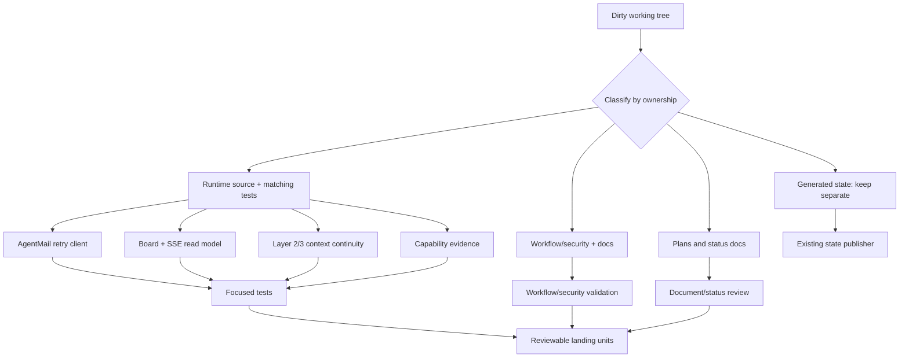

# Separate and Land School Core Product Slices

## Summary

Turn the current mixed `school-core` working tree into independently reviewable,
test-backed product slices. Preserve the live board publisher and all runtime
state, while separating source changes, tests, workflow/security changes, and
planning documents into coherent landing units.

This is an umbrella plan for making the snapshot landable and durable. It does
not authorize broad cleanup, deletion, reset, stash, force-push, or automatic
commit of the current tree.

## Status (2026-08-12)

- **U1 — AgentMail transport:** complete; 34 focused tests, review clean.
- **U2 — Board/SSE read model:** complete; 20 focused + 44 adjacent tests, review clean.
- **U3 — Cross-cycle context:** complete; 60 tests + 1 skip, review clean; fresh-cycle fixture proves newest same-domain archive wins.
- **U4 — Capability evidence:** complete; 142 focused tests, review clean.
- **U5 — Workflow/security contracts:** complete; 24 focused tests, review clean; permission narrowing + token confinement enforced by tests.
- **U6 — Landing policy (this document):** active as the boundary contract for landing the slices.

## Problem Frame

The working tree contains real improvements alongside generated state,
Beads interaction history, and historical planning artifacts. Treating the
snapshot as one commit would make review difficult and could overwrite or
publish state owned by the School Loop. Treating all dirt as disposable would
lose unfinished resilience, observability, and context-continuity work.

The desired result is a clean set of bounded changes where each product slice
has its own tests, reviewers can see the behavior it changes, and generated
state remains under the existing state-publishing workflow.

## Requirements and Success Criteria

- Preserve all meaningful behavior already implemented in the snapshot; do not
  silently revert the AgentMail, board/SSE, context, capability, or workflow
  improvements.
- Keep `data/scores.json` and `.beads/interactions.jsonl` out of source commits
  unless a separate state-publishing policy explicitly owns them.
- Land shared AgentMail transport resilience without reintroducing separate
  poller/notifier implementations or uncontrolled retry loops.
- Make board and SSE lifecycle states observable without turning the board into
  a second task database or routing authority.
- Prove Layer 2 trajectory reuse and Layer 3 same-domain archival continuity in
  a fresh-cycle fixture, while keeping archival failures non-blocking.
- Preserve the canonical capability evidence that explains persona, skills,
  tools, route reason, gate, and fallback in the execution record.
- Keep CI and the self-hosted school-loop workflow aligned on permissions,
  secrets, runner preflight, Nix/verify-gate behavior, and notification safety.
- Reconcile plan/document status so completed historical work is not presented
  as active, while the persona/tool/kanban learning-loop audit remains honest
  about its live-proof boundary.
- End with focused tests for every behavioral slice and a final full-suite/CI
  check performed during execution, not guessed during planning.

## Scope Boundaries

### In scope

- The tracked runtime changes currently present in the working tree:
  AgentMail transport, board/SSE observability, context/consolidation behavior,
  and leaf capability propagation.
- The tracked CI/workflow changes and the related runner-token documentation.
- Matching and newly added tests needed to make those changes reviewable.
- Lifecycle/status corrections to the current planning documents.

### Explicitly excluded from source landing

- `.beads/interactions.jsonl` as a Beads activity log.
- `data/scores.json` as runtime learning state.
- Any unrelated untracked files discovered during execution.
- New product behavior not represented by the current dirty diff.
- A redesign of RouterExperience, persona selection, or the FirstMate protocol.
- A claim that a deterministic fixture replaces a real fresh-checkout live proof.

### Deferred to follow-up work

- Native skill/tool telemetry that changes future routing policy rather than
  merely recording the selected bundle.
- Making the kanban read model itself choose the next persona or action.
- Replacing the two-judge gate with a single automated score.
- A broader migration that deletes compatibility persona sources or runtime
  role maps.
- A separate live FirstMate fresh-checkout proof after the current artifact
  handshake and lifecycle work is intentionally isolated.

## Key Technical Decisions

1. **One umbrella plan, multiple atomic landing units.** The user asked for one
   umbrella plan, but the code should still land in reviewable slices. This
   keeps the planning artifact unified without creating an unreviewable commit.
2. **Generated state is not product code.** Scores and Beads interactions are
   durable operational records with different ownership and publication rules.
   They stay outside product commits and are verified separately.
3. **Retry only transient AgentMail failures.** HTTP 429, 5xx, and transport
   failures may retry within a bounded attempt budget; ordinary 4xx failures
   must fail immediately. `Retry-After` is advisory input, not permission for
   an unbounded sleep loop.
4. **Board is a read model.** Lifecycle columns expose the bridge's states but
   do not mutate GitHub issues, select tools, or become a second task store.
5. **Same-domain archival context wins.** A new session first uses its own
   same-domain consolidation, then the newest prior same-domain archive, and
   only then the compatibility fallback. Missing or malformed context never
   blocks dispatch.
6. **Capability evidence is additive and redacted.** Existing role/profile
   sources remain compatible while the result record gains enough structured
   evidence to explain a dispatch. Secrets, raw prompts, and absolute home
   paths are not durable evidence.
7. **Workflow changes are treated as external contracts.** Environment names,
   permissions, runner labels, and preflight behavior require YAML parsing,
   focused workflow tests, and a live CI result before they are considered
   complete.

## High-Level Technical Design



### Issue lifecycle read path

```text
GitHub issue
  -> bridge/crew/direct execution
  -> last_run + trajectory + capability evidence
  -> board column and SSE payload
  -> human/agent-readable observability

AgentMail transport failures
  -> bounded retry for transient errors
  -> one normalized failure result
  -> existing alert/next-cycle handling
```

## Implementation Units

### U1. Harden the shared AgentMail transport

**Goal:** Make the shared AgentMail client resilient to 429, 5xx, and transient
transport failures while preserving immediate failure for non-retryable 4xx
responses and preserving one key/inbox resolution path.

**Requirements:** AgentMail rate-limit resilience; poller drift prevention;
readable failure behavior; no secret leakage in logs.

**Dependencies:** None.

**Files:**

- `agentmail_client.py`
- `tests/test_school_mail.py`
- `tests/test_agentmail_poller.py`

**Approach:** Keep retry policy in the shared request helper so notifier,
poller, and inbound handler cannot diverge. Use a bounded attempt count, honor a
numeric `Retry-After` when present, use capped backoff otherwise, and never
retry ordinary authentication, authorization, validation, or not-found errors.
Keep key resolution behavior compatible with the standalone cron environment.
Log status and endpoint context without authorization headers or response
bodies that may contain sensitive data.

**Patterns to follow:** Existing shared `req()` contract, current poller and
notifier callers, and the repository's redaction conventions.

**Test scenarios:**

- A 429 with numeric `Retry-After` retries and eventually returns the success
  payload without exceeding the configured attempt budget.
- A 429 without `Retry-After` uses bounded fallback backoff.
- A 500/503 retries; a final transient failure is raised after the last attempt.
- A 400/401/403/404 is raised immediately with no retry.
- A transient URL error retries and then fails deterministically at the cap.
- A successful request does not perform an unnecessary extra attempt.
- The log record contains no API key, bearer token, or raw sensitive body.
- Existing environment/config key and inbox resolution remains compatible with
  both the poller and outbound notification callers.

**Verification:** Focused AgentMail tests pass; all three callers use the shared
transport; a review can identify one bounded retry policy and one redaction
boundary.

### U2. Complete the board and SSE observability read model

**Goal:** Expose the full issue lifecycle, including retry, blocked,
crew-in-flight, and school-failed states, through the static board, JSON API,
and SSE stream without changing task ownership.

**Requirements:** Human-readable operational status; reliable board updates;
consistent static/live representations; safe trajectory links.

**Dependencies:** U1 is not a code dependency, but U2 should land after the
transport slice if both are being reviewed together so notification failures do
not obscure board validation.

**Files:**

- `board.py`
- `activity_server.py`
- `tests/test_board.py`
- `tests/test_board_ux.py`
- `tests/test_activity_server.py`
- `tests/test_sse.py`

**Approach:** Keep one canonical status-to-column mapping and reuse it for
static HTML and `/api/board.json`. Preserve latest `last_run` precedence over
processed/issue-state fallbacks. Ensure SSE sends an initial board event,
change events, and quiet disconnect handling. Keep trajectory identifiers
filename-safe and prevent path traversal. Escape card data in HTML and ensure
live rendering does not create a new source of unescaped markup.

**Patterns to follow:** Existing `assign_column`, `_build_board_json_payload`,
SSE watch-file snapshot, and the local-file-only board data contract.

**Test scenarios:**

- Each supported lifecycle status maps to exactly one stable column.
- An unknown status falls back without hiding an open issue.
- Latest `last_run` wins over an older terminal status and processed set.
- Missing, corrupt, or empty board JSON sources return safe empty/default data.
- Static HTML and JSON expose the same column keys and card membership.
- SSE emits an initial board event and emits a new board event after a watched
  file changes.
- Client disconnects do not produce an unhandled server error.
- Malicious titles and trajectory identifiers cannot inject HTML or escape the
  trajectory directory.

**Verification:** Board, activity-server, UX, and SSE tests pass; a reviewer
can trace one status mapping from source data through both live surfaces.

### U3. Prove cross-cycle Layer 2 and Layer 3 context continuity

**Goal:** Make context reuse deterministic enough that a new school-loop cycle
can safely use prior same-domain learning, while keeping context enrichment
bounded and non-blocking.

**Requirements:** Durable trajectory/consolidation reuse; same-domain freshness;
explicit session behavior; bounded prompt size; fresh-checkout proof.

**Dependencies:** U2 is not behaviorally required, but U3 should use the same
observable issue/run identifiers established by the current pipeline.

**Files:**

- `context_orchestrator.py`
- `consolidation_writer.py`
- `tests/test_context_orchestrator.py`
- `tests/test_consolidation_writer.py`
- `tests/test_cross_cycle_context.py`

**Approach:** Preserve the current session-first lookup, then select the newest
prior same-domain consolidation when the current session has none. Keep the
older unrelated-session fallback only as compatibility behavior and document
that it is weaker evidence. Cap rendered archival context. Treat missing,
malformed, unavailable, or over-budget sources as non-blocking. Use a
fixture that represents a fresh checkout/new session and asserts that a prior
trajectory or consolidation changes the resulting prompt content, not merely
that a file exists.

**Patterns to follow:** Existing `enrich_prompt`,
`load_latest_consolidation_for_domain`, trajectory listing, and non-blocking
error handling.

**Test scenarios:**

- Current-session same-domain consolidation is selected when available.
- New session with no local archive selects the newest prior same-domain file.
- An unrelated prior domain is not selected while a same-domain archive exists.
- Compatibility fallback is used only when no same-domain archive exists.
- Malformed YAML, missing directories, and unavailable search tools return a
  usable prompt rather than failing dispatch.
- Large consolidation content is truncated at the configured budget.
- Layer 2 trajectory context remains available when Layer 3 is absent.
- A fresh-cycle fixture proves prior evidence changes the enriched prompt and
  preserves the requested domain/session boundaries.

**Verification:** Context and consolidation tests pass, including the fresh-cycle
fixture; the plan records any remaining limitation of live fresh-checkout proof
as an operational follow-up rather than overstating the fixture.

### U4. Preserve capability and persona evidence at the leaf boundary

**Goal:** Ensure student execution receives and records the canonical capability
bundle that explains the selected role, profile, skills, tools, gate, escalation,
and fallback reason.

**Requirements:** Explicit capability-to-persona propagation; useful Telegram,
GitHub, and next-agent observability; redacted durable records.

**Dependencies:** Existing capability resolver and issue/crew bridge contract;
U4 should follow the current capability implementation rather than creating a
second resolver.

**Files:**

- `leaf.py`
- `capabilities.py`
- `tests/test_leaf.py`
- `tests/test_capabilities.py`
- `tests/test_issue_bridge.py`

**Approach:** Thread the already-resolved capability bundle through leaf
construction and student execution. Record a compact structured evidence block,
not the full prompt or environment. Keep compatibility with direct-Orca and
crew paths. Preserve explicit fallback and escalation fields so a human can
see whether the requested persona/tool policy was used or bypassed.

**Patterns to follow:** Existing `CapabilityBundle` resolver, leaf lifecycle,
bookbag/`last_run` serialization, and current redaction/sanitization helpers.

**Test scenarios:**

- A resolved bundle reaches the leaf with the expected role, profile, skills,
  and allowed tools.
- Direct execution and crew execution preserve the same capability evidence.
- Missing optional capability metadata uses a safe compatibility default.
- Fallback records the reason without replacing the original requested policy.
- Durable evidence excludes API keys, bearer values, raw prompts, and absolute
  home paths.
- Existing leaf disposal and report behavior remain unchanged when capability
  metadata is absent.

**Verification:** Leaf, capability, and bridge tests pass; one result record is
sufficient to answer who acted, with which tools, and why.

### U5. Reconcile CI and self-hosted workflow contracts

**Goal:** Land the workflow and security changes as a separately reviewable
control-plane slice, with CI parity for secrets, permissions, runner health,
Nix/verify-gate behavior, crew preflight, and notifications.

**Requirements:** Green CI; least-privilege workflow permissions; no token
printing; clear self-hosted runner failure; consistent environment contracts.

**Dependencies:** U1–U4 behavior should be stable enough that workflow failures
identify integration issues rather than moving source targets.

**Files:**

- `.github/workflows/ci.yml`
- `.github/workflows/school-loop.yml`
- `tests/test_school_loop_workflow.py`
- `tests/test_verify_gate.py`
- `docs/security/runner-token-rotation.md`

**Approach:** Treat workflow YAML as an external interface. Validate the actual
job dependencies, runner labels, secret names, permissions, timeout behavior,
Nix discovery/verify gate, `fm_doctor` preflight, and `CREW_ENABLED` wiring.
Keep hosted gate failures distinct from self-hosted execution failures. Ensure
notification jobs depend on the correct terminal outcomes and that secrets are
passed through environment bindings without appearing in logs.

**Test scenarios:**

- Workflow YAML parses and required jobs, dependencies, runner labels, and
  environment names are present.
- CI and school-loop use the intended secret names and do not expose values in
  command output or artifacts.
- Missing runner, Nix, or crew infrastructure produces a clear failed/preflight
  result rather than a cryptic spawn error.
- Verify-gate strict/non-strict behavior matches the documented policy.
- Notification behavior covers success, school-failed, retry-pending, and
  infrastructure-blocked outcomes without duplicate sends.
- Runner-token documentation matches the minimum permissions and rotation
  procedure actually expected by the workflow.

**Verification:** Workflow tests and verify-gate tests pass; CI is green on the
landed SHA; the live workflow contract is reviewed without requiring a local
secret or a destructive runner operation.

### U6. Reconcile plans, manifests, and landing policy

**Goal:** Make the durable documentation describe the real state of the
pipeline and provide an unambiguous boundary for future execution.

**Requirements:** No stale “active” claims for completed work; explicit
remaining aspirations; portable repo-relative paths; clear separation of
product, plan, and generated state.

**Dependencies:** U1–U5 findings, because document status must reflect what is
actually validated rather than what was originally intended.

**Files:**

- `docs/plans/2026-08-11-001-feat-pipeline-context-verify-dispatch-plan.md`
- `docs/plans/2026-08-11-001-u1-u6-landing-manifest.md`
- `docs/plans/2026-08-11-003-feat-crew-issue-path-compound-plan.md`
- `docs/plans/2026-08-12-001-persona-tool-kanban-learning-loop-audit.md`
- `docs/plans/2026-08-12-002-refactor-dirty-tree-product-slices-plan.md`

**Approach:** Update lifecycle metadata and status prose in place where the
historical documents are still useful. Mark completed U1–U9 material as
completed/evidenced, keep the persona/tool audit active only where its stated
live-proof boundary remains, and retain the current plan as the umbrella
landing contract. Do not rewrite history or remove evidence of failed live
runs. Keep all paths repo-relative.

**Test expectation:** none — this unit changes planning/documentation state,
not runtime behavior. Validate by checking that every active claim names its
evidence or remaining blocker and that no document contradicts the generated
state ownership policy.

**Verification:** A new reader can determine what is complete, what remains,
which slice owns a dirty file, and why runtime state is intentionally excluded.

## Dependency and Landing Order

```text
U1 ─┐
U2 ─┼──> U5 ──> U6
U3 ─┤
U4 ─┘
```

Recommended execution order:

1. U1 — stabilize shared transport and remove poller/notifier drift.
2. U2 — make lifecycle state visible in board and SSE surfaces.
3. U3 — prove cross-cycle context behavior with bounded fixtures.
4. U4 — preserve capability evidence through leaf execution.
5. U5 — validate the workflow/security contract against the stabilized code.
6. U6 — reconcile plan status and record the final boundary.

The units may be implemented in parallel only when their file sets do not
intersect; workflow validation should remain after the runtime contracts are
stable.

## System-Wide Impact

- **Operators:** receive clearer retry, blocked, crew, and failure states and
  should no longer need to infer lifecycle from raw logs.
- **Issue authors:** see the same lifecycle reflected in GitHub comments,
  AgentMail alerts, board data, and workflow outcomes.
- **Student/teacher agents:** receive more consistent capability and context
  evidence, without receiving credentials or unrestricted tools.
- **Maintainers:** gain smaller review boundaries and fewer sources of truth for
  AgentMail transport and status mapping.
- **CI/runner owners:** get explicit preflight and secret/permission contracts,
  but must preserve the existing self-hosted runner and state-publisher model.

## Risk Analysis and Mitigation

| Risk | Mitigation |
|---|---|
| Dirty runtime state is accidentally included in a source commit | Use the explicit file boundary for each unit; treat scores and Beads logs as excluded state. |
| AgentMail retries amplify rate limits | Retry only 429/5xx/transport failures, honor bounded attempts, cap delay, and test hard 4xx no-retry behavior. |
| Board status diverges between HTML, JSON, and SSE | Keep one mapping function and assert parity across all surfaces. |
| Context continuity imports stale or unrelated learning | Prefer same-domain evidence, bound content, and test fallback ordering explicitly. |
| Capability evidence leaks sensitive data | Serialize allowlisted fields only and test redaction of tokens, prompts, and home paths. |
| Workflow changes pass YAML parsing but fail on the real runner | Test the contract and require a real CI/live workflow result before marking U5 complete. |
| Historical plans overstate completion | Update status only after evidence exists; preserve failed-run records as evidence. |

## Operational Notes

The current remote `main` may move because the School Loop publishes board state.
Execution must reconcile that moving state without resetting or overwriting a
dirty checkout. A disposable clean worktree may be used for reconciliation, but
it must not be used to hide or discard local product changes.

No source unit is complete merely because its files exist. Completion requires
the unit's focused tests, review of its boundary, and a final verification that
excluded generated state was not included.

## Deferred Questions

- Should RouterExperience eventually key on domain and difficulty in addition to
  task role? This is a future routing-policy decision, not required to land the
  current capability evidence.
- What is the authoritative live fresh-checkout FirstMate proof after the
  artifact handshake fix? The fixture in U3 is necessary but not sufficient for
  that operational claim.
- Should board state be retained indefinitely or compacted by the publisher?
  Defer until state ownership and retention requirements are explicit.

## Completion Checklist

- [ ] U1 AgentMail retry policy and tests are independently reviewed.
- [ ] U2 board/SSE lifecycle parity and safety tests pass.
- [ ] U3 fresh-cycle Layer 2/Layer 3 fixture passes with bounded fallback.
- [ ] U4 capability evidence survives direct and crew/leaf paths.
- [ ] U5 workflow/security tests pass and CI is green.
- [ ] U6 plans and manifests accurately describe completed and deferred work.
- [ ] `data/scores.json` and `.beads/interactions.jsonl` remain outside source
      landing boundaries.
- [ ] Final working-tree and remote-state report is produced without deleting
      unrelated files.
